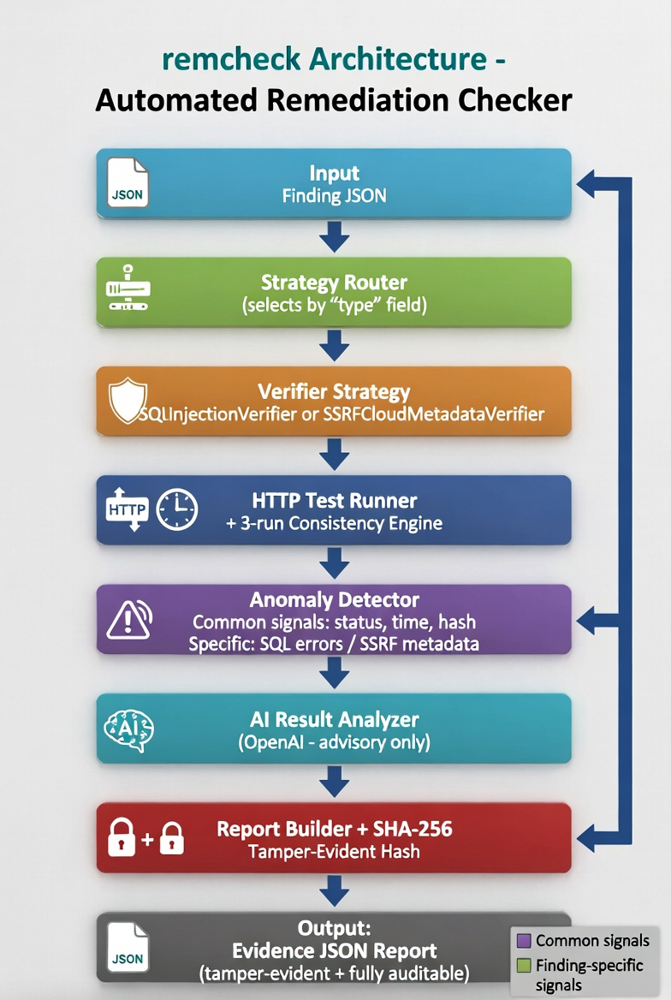

# Part A - System Architecture Document

## 1. Routing logic
The system uses a simple registry function `get_verifier(finding_type)`.  
It reads the "type" field and returns the correct strategy class.  
New finding types only need a new class + one registry line.

## 2. Evidence model
Exact JSON schema + SHA-256 hash of the entire report (excluding the hash field).  
Tamper-evident and fully auditable.

## 3. Anomaly detection
Common signals (status, time >2×p95, hash) + specific signals (SQL errors / SSRF metadata).

## 4. Inconsistent results
Auto re-run up to 3 times. Different results → INCONCLUSIVE.

## Component Diagram

Legend: Purple = Common signals | Green = Finding-specific signals
